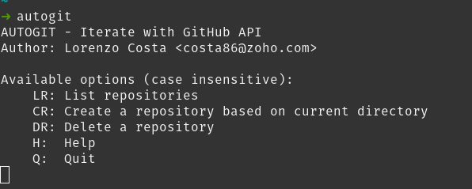
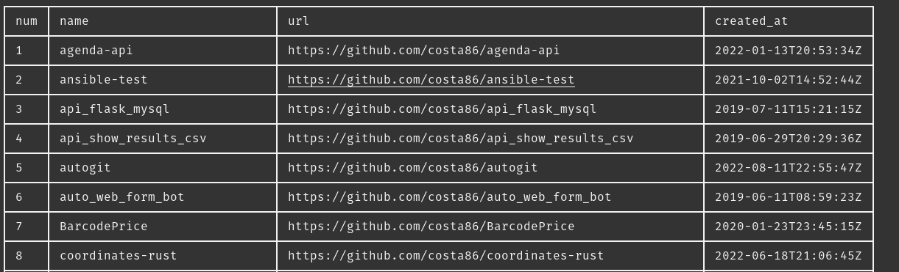

# Autogit

An interactive CLI tool to automate operations on GitHub using its API

## Usage

    ./autogit

## Features

1. Create a repository
2. List all repositories
3. Delete a repository

## Requirements
1. A GitHub Token
2. Have `GITHUB_TOKEN` and `GITHUB_USER` set as environment vars

## Images

Menu

Respository list (LR option)

