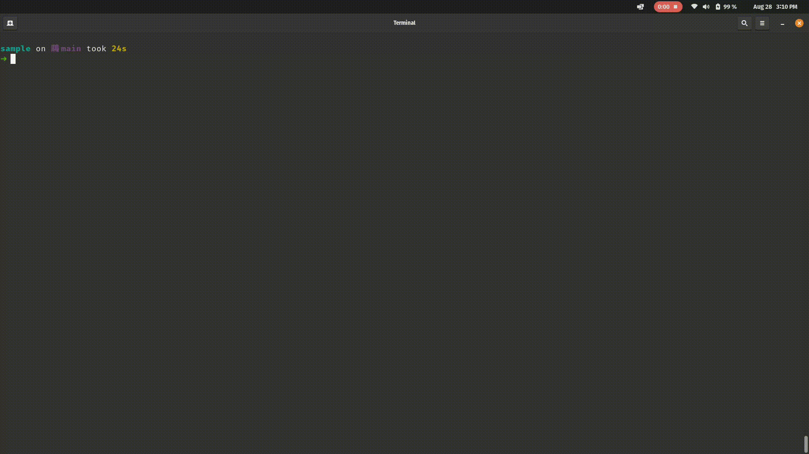

# Autogit

An interactive CLI tool to automate operations on GitHub using its API

## 1. Features

1. Create a repository
2. Display all repositories
3. Delete a repository
4. Visit repository page

## 2. Demo

## 3. Requirements
1. A GitHub Token
2. Have `GITHUB_TOKEN` (your GitHub username) and `GITHUB_USER` (your GitHub Token) set as environment vars

## 4. Instalation
### 3.1 Cargo

    cargo install autogit

### 4.2 Ready-to-use executable

|OS|Architecture| File*|
|--|--|--|
|Linux|x86_64|[autogit](https://github.com/costa86/autogit/blob/master/autogit)|
|Windows|x86_64|[autogit.exe](https://github.com/costa86/autogit/blob/master/autogit.exe)|

    ./autogit

